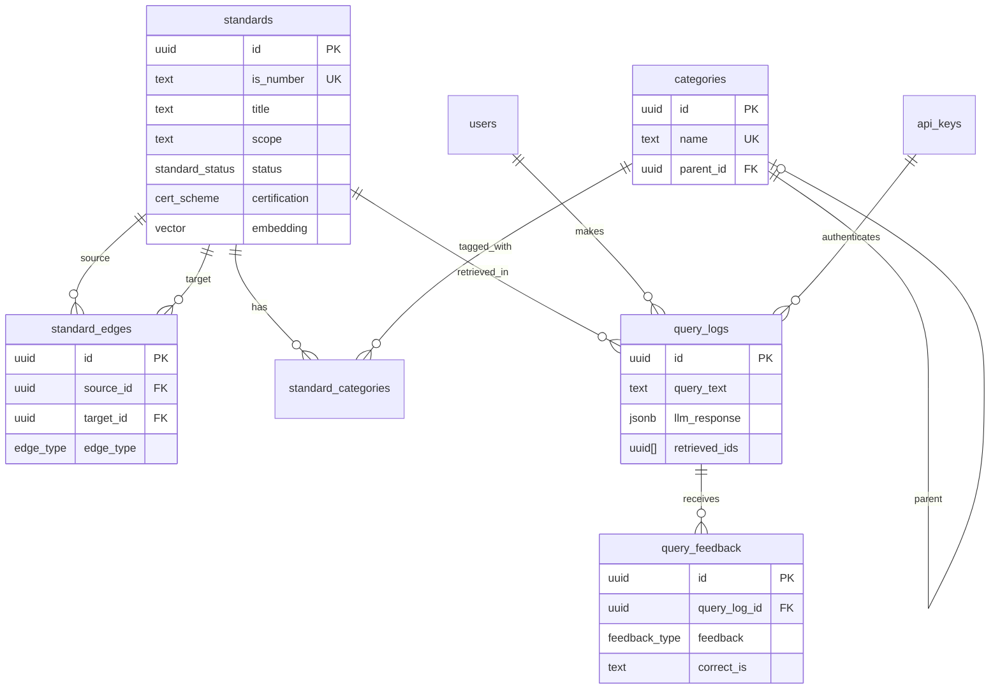
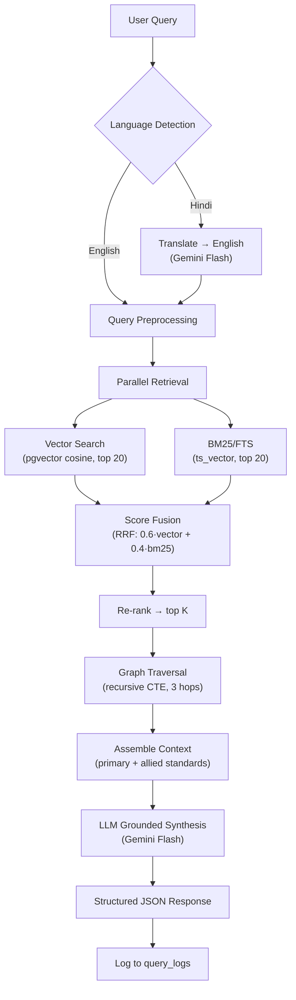

# DB Schema & API Design — SIH26108

## Stack Decisions

| Layer | Choice |
|---|---|
| Backend | FastAPI (Python 3.12+) |
| Database | PostgreSQL 16 + pgvector |
| Cache | Redis 7 |
| Embeddings | BGE-M3 (1024-dim, self-hosted) |
| LLM | Gemini 2.0 Flash (Google AI) |
| Auth | API keys (header) + optional JWT |
| Languages | Hindi + English |
| Deploy | Docker Compose → Cloud Run |

---

## 1. Database Schema

### 1.1 Core Tables

```sql
-- Extension setup
CREATE EXTENSION IF NOT EXISTS vector;
CREATE EXTENSION IF NOT EXISTS pg_trgm;  -- for fuzzy text search

-- ────────────────────────────────────────────
-- ENUM types
-- ────────────────────────────────────────────

CREATE TYPE standard_status AS ENUM (
  'current',
  'superseded',
  'withdrawn',
  'under_revision'
);

CREATE TYPE edge_type AS ENUM (
  'supersedes',        -- A supersedes B
  'normative_ref',     -- A normatively references B
  'informative_ref',   -- A informatively references B
  'amendment_of'       -- A is an amendment of B
);

CREATE TYPE cert_scheme AS ENUM (
  'isi_mark',          -- BIS ISI certification
  'crs',              -- Compulsory Registration Scheme
  'hallmarking',       -- Gold jewellery hallmarking
  'qco',              -- Quality Control Order
  'none'
);

CREATE TYPE feedback_type AS ENUM (
  'thumbs_up',
  'thumbs_down',
  'wrong_standard',
  'missing_standard',
  'outdated_info'
);

-- ────────────────────────────────────────────
-- 1. STANDARDS (core knowledge base)
-- ────────────────────────────────────────────

CREATE TABLE standards (
  id              UUID PRIMARY KEY DEFAULT gen_random_uuid(),
  is_number       TEXT NOT NULL UNIQUE,        -- e.g. "IS 2062:2011"
  is_number_base  TEXT NOT NULL,               -- e.g. "IS 2062" (without year)
  title           TEXT NOT NULL,
  title_hi        TEXT,                        -- Hindi title (if available)
  scope           TEXT,                        -- scope/abstract from BIS
  classification  TEXT NOT NULL,               -- e.g. "Metallurgy/Steel"
  sub_group       TEXT,                        -- e.g. "Hot Rolled Products"
  status          standard_status NOT NULL DEFAULT 'current',
  year_published  SMALLINT,
  latest_amendment TEXT,                       -- e.g. "Amd 3, Oct 2023"
  certification   cert_scheme NOT NULL DEFAULT 'none',
  qco_details     TEXT,                        -- QCO notification number if applicable
  source_url      TEXT,                        -- BIS detail page URL
  embedding       vector(1024),                -- BGE-M3 embedding of title+scope+classification
  raw_metadata    JSONB,                       -- full scraped metadata blob

  created_at      TIMESTAMPTZ NOT NULL DEFAULT now(),
  updated_at      TIMESTAMPTZ NOT NULL DEFAULT now()
);

-- Indexes
CREATE INDEX idx_standards_is_number_base ON standards (is_number_base);
CREATE INDEX idx_standards_classification ON standards USING gin (classification gin_trgm_ops);
CREATE INDEX idx_standards_title_trgm     ON standards USING gin (title gin_trgm_ops);
CREATE INDEX idx_standards_status         ON standards (status);
CREATE INDEX idx_standards_certification  ON standards (certification);
CREATE INDEX idx_standards_embedding      ON standards USING ivfflat (embedding vector_cosine_ops)
  WITH (lists = 100);  -- tune lists = sqrt(n_rows) for production

-- Full-text search (BM25-style)
ALTER TABLE standards ADD COLUMN tsv tsvector
  GENERATED ALWAYS AS (
    setweight(to_tsvector('english', coalesce(title, '')), 'A') ||
    setweight(to_tsvector('english', coalesce(scope, '')), 'B') ||
    setweight(to_tsvector('english', coalesce(classification, '')), 'C')
  ) STORED;
CREATE INDEX idx_standards_tsv ON standards USING gin (tsv);


-- ────────────────────────────────────────────
-- 2. CROSS-REFERENCE GRAPH (adjacency table)
-- ────────────────────────────────────────────

CREATE TABLE standard_edges (
  id          UUID PRIMARY KEY DEFAULT gen_random_uuid(),
  source_id   UUID NOT NULL REFERENCES standards(id) ON DELETE CASCADE,
  target_id   UUID NOT NULL REFERENCES standards(id) ON DELETE CASCADE,
  edge_type   edge_type NOT NULL,
  notes       TEXT,                            -- e.g. "clause 4.2 reference"
  created_at  TIMESTAMPTZ NOT NULL DEFAULT now(),

  UNIQUE (source_id, target_id, edge_type)
);

CREATE INDEX idx_edges_source ON standard_edges (source_id);
CREATE INDEX idx_edges_target ON standard_edges (target_id);
CREATE INDEX idx_edges_type   ON standard_edges (edge_type);


-- ────────────────────────────────────────────
-- 3. PRODUCT CATEGORIES
-- ────────────────────────────────────────────

CREATE TABLE categories (
  id          UUID PRIMARY KEY DEFAULT gen_random_uuid(),
  name        TEXT NOT NULL UNIQUE,            -- e.g. "Construction Materials"
  name_hi     TEXT,                            -- Hindi name
  description TEXT,
  parent_id   UUID REFERENCES categories(id), -- for subcategory tree
  created_at  TIMESTAMPTZ NOT NULL DEFAULT now()
);

CREATE TABLE standard_categories (
  standard_id  UUID NOT NULL REFERENCES standards(id) ON DELETE CASCADE,
  category_id  UUID NOT NULL REFERENCES categories(id) ON DELETE CASCADE,
  PRIMARY KEY (standard_id, category_id)
);


-- ────────────────────────────────────────────
-- 4. AUTH
-- ────────────────────────────────────────────

CREATE TABLE api_keys (
  id          UUID PRIMARY KEY DEFAULT gen_random_uuid(),
  key_hash    TEXT NOT NULL UNIQUE,            -- SHA-256 of the actual key
  name        TEXT NOT NULL,                   -- human label, e.g. "GeM Integration"
  is_active   BOOLEAN NOT NULL DEFAULT true,
  rate_limit  INT NOT NULL DEFAULT 60,         -- requests per minute
  created_at  TIMESTAMPTZ NOT NULL DEFAULT now(),
  expires_at  TIMESTAMPTZ
);

CREATE TABLE users (
  id            UUID PRIMARY KEY DEFAULT gen_random_uuid(),
  email         TEXT NOT NULL UNIQUE,
  password_hash TEXT NOT NULL,
  name          TEXT,
  role          TEXT NOT NULL DEFAULT 'user',   -- 'user' | 'admin'
  is_active     BOOLEAN NOT NULL DEFAULT true,
  created_at    TIMESTAMPTZ NOT NULL DEFAULT now()
);


-- ────────────────────────────────────────────
-- 5. QUERY LOG + FEEDBACK (audit trail)
-- ────────────────────────────────────────────

CREATE TABLE query_logs (
  id              UUID PRIMARY KEY DEFAULT gen_random_uuid(),
  user_id         UUID REFERENCES users(id),     -- NULL for API-key queries
  api_key_id      UUID REFERENCES api_keys(id),  -- NULL for JWT queries
  query_text      TEXT NOT NULL,
  detected_lang   TEXT NOT NULL DEFAULT 'en',     -- 'en' | 'hi'
  translated_text TEXT,                           -- English translation if input was Hindi
  category_hint   TEXT,                           -- user-supplied category filter (optional)

  -- Retrieval results
  retrieved_ids   UUID[],                         -- ordered list of retrieved standard IDs
  retrieval_scores FLOAT[],                       -- parallel array of scores

  -- LLM output
  llm_response    JSONB NOT NULL,                 -- full structured response
  llm_model       TEXT,                           -- e.g. "gemini-2.0-flash"
  llm_latency_ms  INT,

  -- Timing
  total_latency_ms INT,
  created_at      TIMESTAMPTZ NOT NULL DEFAULT now()
);

CREATE INDEX idx_query_logs_user    ON query_logs (user_id);
CREATE INDEX idx_query_logs_created ON query_logs (created_at);

CREATE TABLE query_feedback (
  id           UUID PRIMARY KEY DEFAULT gen_random_uuid(),
  query_log_id UUID NOT NULL REFERENCES query_logs(id) ON DELETE CASCADE,
  feedback     feedback_type NOT NULL,
  correct_is   TEXT,                             -- user-corrected IS number
  comment      TEXT,
  created_at   TIMESTAMPTZ NOT NULL DEFAULT now()
);

CREATE INDEX idx_feedback_query ON query_feedback (query_log_id);


-- ────────────────────────────────────────────
-- 6. EVALUATION SETS (for precision/recall)
-- ────────────────────────────────────────────

CREATE TABLE eval_queries (
  id              UUID PRIMARY KEY DEFAULT gen_random_uuid(),
  query_text      TEXT NOT NULL,
  expected_is     TEXT[] NOT NULL,                -- ground-truth IS numbers
  category        TEXT,
  notes           TEXT,
  created_at      TIMESTAMPTZ NOT NULL DEFAULT now()
);
```

### 1.2 Key Recursive CTE — Graph Traversal

```sql
-- Get all related standards (up to 3 hops) for a given standard
WITH RECURSIVE related AS (
  -- Base: direct edges from the target standard
  SELECT
    e.target_id AS standard_id,
    e.edge_type,
    1 AS depth
  FROM standard_edges e
  WHERE e.source_id = :standard_id

  UNION

  -- Recurse: follow edges from discovered standards
  SELECT
    e.target_id,
    e.edge_type,
    r.depth + 1
  FROM standard_edges e
  JOIN related r ON e.source_id = r.standard_id
  WHERE r.depth < 3  -- max 3 hops
)
SELECT DISTINCT s.*, r.edge_type, r.depth
FROM related r
JOIN standards s ON s.id = r.standard_id
ORDER BY r.depth, s.is_number;
```

### 1.3 ER Diagram



---

## 2. API Design

**Base URL:** `/api/v1`
**Auth:** `X-API-Key` header or `Authorization: Bearer <jwt>` header.
**Content-Type:** `application/json`

### 2.1 Recommendation (Core)

#### `POST /api/v1/recommend`

The main endpoint. Takes a product description, returns ranked IS standard recommendations.

**Request:**
```json
{
  "query": "3-seater steel office chair with adjustable height for government office use",
  "category": "furniture",           // optional — narrows retrieval
  "top_k": 5,                        // optional, default 5
  "include_allied": true,            // optional, default true — traverse graph
  "language": "en"                   // optional, auto-detected if omitted
}
```

**Response:**
```json
{
  "query_id": "uuid",
  "detected_language": "en",
  "recommendations": [
    {
      "is_number": "IS 7390:2024",
      "title": "Steel Office Chairs — Specification",
      "status": "current",
      "confidence": 0.92,
      "match_reason": "Direct match: steel office chair specification covering dimensions, materials, and load testing",
      "source_url": "https://services.bis.gov.in/...",
      "certification": {
        "scheme": "isi_mark",
        "mandatory": true,
        "details": "ISI mark mandatory under QCO for steel furniture"
      },
      "supersession": null,
      "allied_standards": [
        {
          "is_number": "IS 2062:2011",
          "title": "Hot Rolled Low, Medium and High Tensile Structural Steel Specification",
          "relationship": "normative_ref",
          "reason": "Steel material specification referenced in IS 7390 clause 4.2"
        },
        {
          "is_number": "IS 7206 (Part 1):1986",
          "title": "Furniture Tests — Part 1: Strength and Durability",
          "relationship": "normative_ref",
          "reason": "Testing method for load and durability"
        }
      ]
    }
  ],
  "warnings": [
    {
      "type": "superseded_in_results",
      "message": "IS 7390:1975 was superseded by IS 7390:2024. Recommendation uses the current version."
    }
  ],
  "metadata": {
    "retrieval_method": "hybrid_bm25_vector",
    "llm_model": "gemini-2.0-flash",
    "total_latency_ms": 1240
  }
}
```

**Error (low confidence):**
```json
{
  "query_id": "uuid",
  "recommendations": [],
  "warnings": [
    {
      "type": "no_confident_match",
      "message": "No Indian Standard matched with sufficient confidence. Consider refining the product description or specifying a category."
    }
  ]
}
```

---

### 2.2 Standards Browse/Search

#### `GET /api/v1/standards/{is_number}`

**Response:**
```json
{
  "id": "uuid",
  "is_number": "IS 2062:2011",
  "title": "Hot Rolled Low, Medium and High Tensile Structural Steel Specification",
  "title_hi": "गर्म-बेलित निम्न, मध्यम और उच्च तनन संरचनात्मक इस्पात विनिर्देश",
  "scope": "This standard covers the requirements of...",
  "classification": "Metallurgy/Steel",
  "sub_group": "Hot Rolled Products",
  "status": "current",
  "year_published": 2011,
  "latest_amendment": "Amd 3, Oct 2023",
  "certification": "isi_mark",
  "source_url": "https://services.bis.gov.in/...",
  "cross_references": {
    "supersedes": ["IS 2062:2006"],
    "superseded_by": null,
    "normative_refs": ["IS 228:1987", "IS 1608:2005"],
    "referenced_by": ["IS 7390:2024", "IS 11956:1986"]
  },
  "categories": ["Construction Materials", "Furniture"]
}
```

#### `GET /api/v1/standards`

**Query params:**
| Param | Type | Description |
|---|---|---|
| `q` | string | Free-text search (BM25 over title+scope) |
| `category` | string | Filter by category name |
| `status` | enum | `current` / `superseded` / `withdrawn` |
| `certification` | enum | `isi_mark` / `crs` / `hallmarking` / `qco` |
| `page` | int | Pagination (default 1) |
| `per_page` | int | Items per page (default 20, max 100) |

**Response:**
```json
{
  "total": 347,
  "page": 1,
  "per_page": 20,
  "results": [
    { "is_number": "...", "title": "...", "status": "...", "classification": "..." }
  ]
}
```

---

### 2.3 Categories

#### `GET /api/v1/categories`

Returns the category tree.

```json
{
  "categories": [
    {
      "id": "uuid",
      "name": "Construction Materials",
      "name_hi": "निर्माण सामग्री",
      "children": [
        { "id": "uuid", "name": "Cement", "name_hi": "सीमेंट" },
        { "id": "uuid", "name": "Steel", "name_hi": "इस्पात" }
      ],
      "standard_count": 412
    }
  ]
}
```

---

### 2.4 Feedback

#### `POST /api/v1/feedback`

```json
{
  "query_id": "uuid",
  "feedback": "wrong_standard",     // thumbs_up | thumbs_down | wrong_standard | missing_standard | outdated_info
  "correct_is": "IS 1234:2020",    // optional
  "comment": "Should also include IS 4567"  // optional
}
```

**Response:** `201 Created`

---

### 2.5 Auth

#### `POST /api/v1/auth/register`
```json
{ "email": "officer@gov.in", "password": "...", "name": "Amit Kumar" }
```

#### `POST /api/v1/auth/login`
```json
{ "email": "officer@gov.in", "password": "..." }
```
**Response:**
```json
{ "access_token": "jwt...", "token_type": "bearer", "expires_in": 3600 }
```

---

### 2.6 Evaluation (Admin)

#### `POST /api/v1/eval/run`

Runs the recommendation engine against all eval queries and returns precision/recall.

```json
{
  "precision_at_5": 0.82,
  "recall_at_5": 0.76,
  "mrr": 0.88,
  "total_queries": 20,
  "results": [
    {
      "query": "steel office chair",
      "expected": ["IS 7390:2024"],
      "retrieved": ["IS 7390:2024", "IS 2062:2011"],
      "hit": true
    }
  ]
}
```

---

## 3. Hybrid Retrieval Pipeline



### 3.1 Reciprocal Rank Fusion (RRF) SQL

```sql
WITH vector_results AS (
  SELECT id, is_number, title, scope,
         1 - (embedding <=> :query_embedding) AS vec_score,
         ROW_NUMBER() OVER (ORDER BY embedding <=> :query_embedding) AS vec_rank
  FROM standards
  WHERE status = 'current'
  ORDER BY embedding <=> :query_embedding
  LIMIT 20
),
bm25_results AS (
  SELECT id, is_number, title, scope,
         ts_rank_cd(tsv, plainto_tsquery('english', :query_text)) AS bm25_score,
         ROW_NUMBER() OVER (ORDER BY ts_rank_cd(tsv, plainto_tsquery('english', :query_text)) DESC) AS bm25_rank
  FROM standards
  WHERE tsv @@ plainto_tsquery('english', :query_text)
    AND status = 'current'
  ORDER BY bm25_score DESC
  LIMIT 20
),
fused AS (
  SELECT
    COALESCE(v.id, b.id) AS id,
    COALESCE(v.is_number, b.is_number) AS is_number,
    COALESCE(v.title, b.title) AS title,
    -- RRF formula: 1/(k + rank)
    COALESCE(0.6 / (60 + v.vec_rank), 0) +
    COALESCE(0.4 / (60 + b.bm25_rank), 0) AS rrf_score
  FROM vector_results v
  FULL OUTER JOIN bm25_results b ON v.id = b.id
)
SELECT * FROM fused
ORDER BY rrf_score DESC
LIMIT :top_k;
```

---

## 4. Redis Cache Strategy

| Key pattern | TTL | Purpose |
|---|---|---|
| `embedding:{sha256(text)}` | 24h | Cache computed query embeddings |
| `recommend:{sha256(query+category)}` | 1h | Cache full recommendation responses |
| `standard:{is_number}` | 6h | Cache individual standard lookups |
| `categories:tree` | 12h | Cache category tree |
| `rate:{api_key_id}:{minute}` | 60s | Rate limiting counter |

---

## 5. Project Structure

```
SIH26108/
├── backend/
│   ├── app/
│   │   ├── __init__.py
│   │   ├── main.py                 # FastAPI app, CORS, lifespan
│   │   ├── config.py               # Settings (env vars)
│   │   ├── database.py             # SQLAlchemy/asyncpg setup
│   │   ├── models/                 # SQLAlchemy ORM models
│   │   │   ├── standard.py
│   │   │   ├── edge.py
│   │   │   ├── category.py
│   │   │   ├── user.py
│   │   │   ├── query_log.py
│   │   │   └── eval.py
│   │   ├── schemas/                # Pydantic request/response schemas
│   │   │   ├── recommend.py
│   │   │   ├── standard.py
│   │   │   ├── feedback.py
│   │   │   └── auth.py
│   │   ├── api/                    # Route handlers
│   │   │   ├── recommend.py
│   │   │   ├── standards.py
│   │   │   ├── categories.py
│   │   │   ├── feedback.py
│   │   │   ├── auth.py
│   │   │   └── eval.py
│   │   ├── services/               # Business logic
│   │   │   ├── retriever.py        # Hybrid vector+BM25 retrieval
│   │   │   ├── graph.py            # Cross-reference traversal
│   │   │   ├── embedder.py         # BGE-M3 embedding generation
│   │   │   ├── synthesizer.py      # Gemini LLM grounded synthesis
│   │   │   ├── translator.py       # Hindi↔English translation
│   │   │   └── cache.py            # Redis caching layer
│   │   ├── middleware/
│   │   │   ├── auth.py             # API key + JWT verification
│   │   │   └── rate_limit.py
│   │   └── utils/
│   │       └── language.py         # Language detection
│   ├── alembic/                    # DB migrations
│   ├── tests/
│   ├── requirements.txt
│   └── Dockerfile
├── data/
│   ├── scrapers/                   # BIS metadata scrapers
│   │   ├── bis_know_your_standards.py
│   │   └── schemes_through_standards.py
│   ├── ingestion/                  # Parse + embed + load into DB
│   │   ├── ingest_standards.py
│   │   └── build_graph.py
│   ├── eval/                       # Evaluation test queries
│   │   └── eval_queries.json
│   └── seed/                       # Sample seed data
│       └── seed_standards.csv
├── docs/
│   └── db_and_api_design.md
├── docker-compose.yml
├── .env.example
└── README.md
```

---

## 6. Docker Compose (Dev)

```yaml
version: "3.9"
services:
  db:
    image: pgvector/pgvector:pg16
    environment:
      POSTGRES_DB: sih26108
      POSTGRES_USER: sih
      POSTGRES_PASSWORD: ${DB_PASSWORD}
    ports: ["5432:5432"]
    volumes: ["pgdata:/var/lib/postgresql/data"]

  redis:
    image: redis:7-alpine
    ports: ["6379:6379"]

  api:
    build: ./backend
    ports: ["8000:8000"]
    environment:
      DATABASE_URL: postgresql+asyncpg://sih:${DB_PASSWORD}@db:5432/sih26108
      REDIS_URL: redis://redis:6379
      GEMINI_API_KEY: ${GEMINI_API_KEY}
      BGE_MODEL_PATH: /models/bge-m3
      JWT_SECRET: ${JWT_SECRET}
    depends_on: [db, redis]
    volumes: ["./backend:/app"]

volumes:
  pgdata:
```

---

## 7. Key Design Decisions & Rationale

> [!IMPORTANT]
> **Grounding guardrail**: LLM never sees the full standards DB. Only the top-K retrieved candidates are passed into its context window with the instruction: *"Only reference standards provided in context. If none match with reasonable confidence, say 'no confident match found.'"*

> [!NOTE]
> **Why adjacency tables over Neo4j?** With ~2,000 standards in Phase 1 and ~5-10 edges per standard, the graph has ~10-20K edges. Recursive CTEs with a 3-hop depth limit handle this in <10ms. Neo4j adds ops complexity with no perf benefit at this scale.

> [!NOTE]
> **Why BGE-M3 over API embeddings?** Self-hosted = no per-query cost, no vendor lock-in, no latency to external API. BGE-M3 handles Hindi/English natively. GPU inference on a single T4 handles the throughput needed.

> [!TIP]
> **RRF (Reciprocal Rank Fusion)** with 0.6 vector + 0.4 BM25 weights ensures exact keyword matches (e.g., "PVC pipes" → IS 4985) don't get drowned by semantically similar but wrong results, while still leveraging embedding similarity for natural-language queries.
